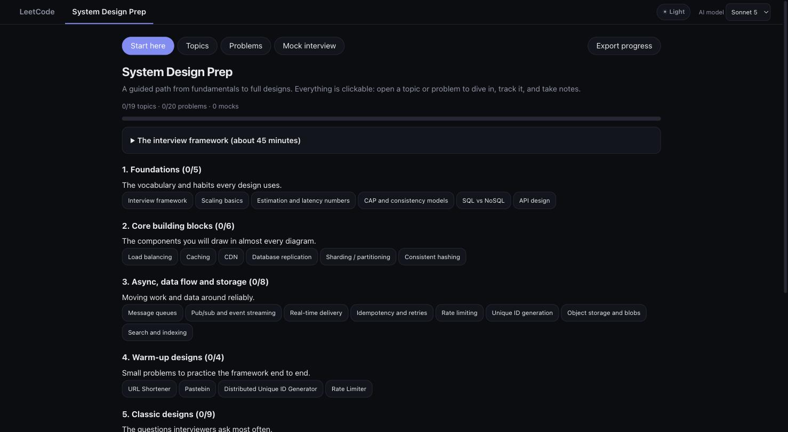
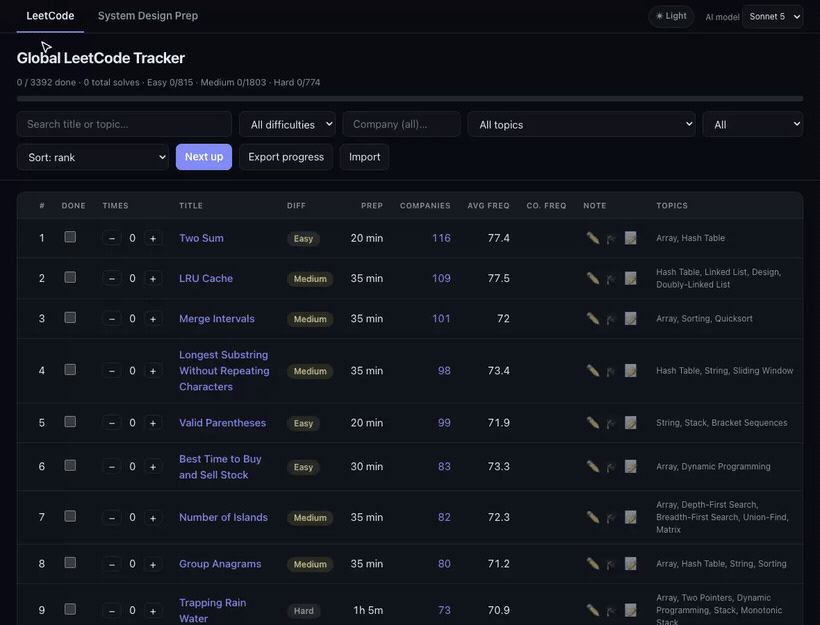
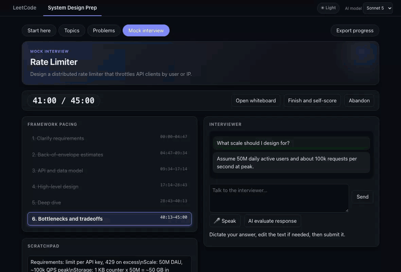
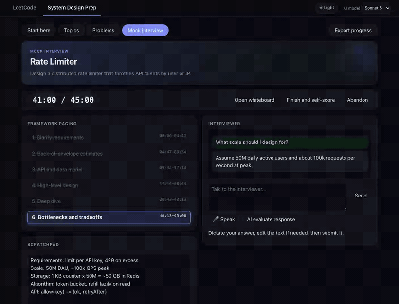
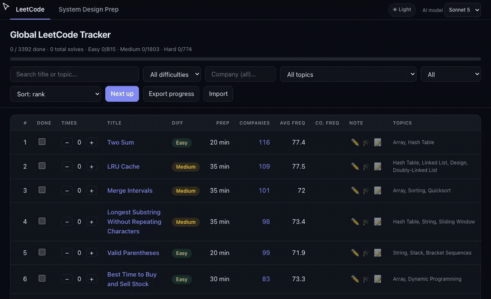
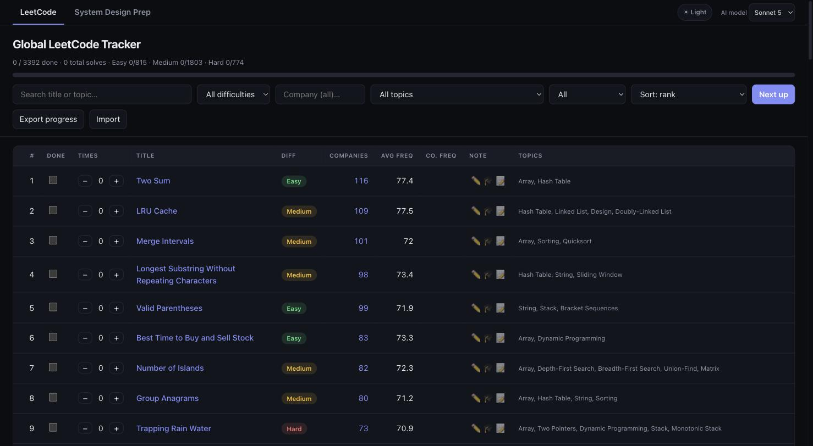
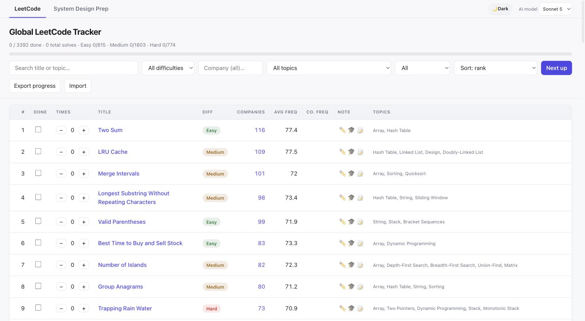
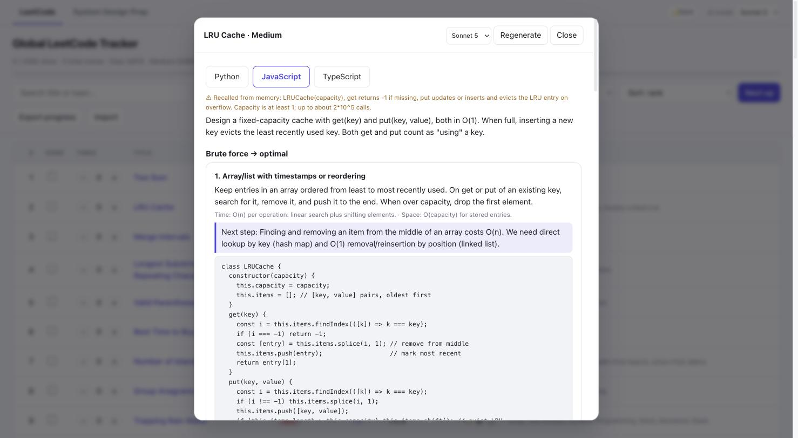
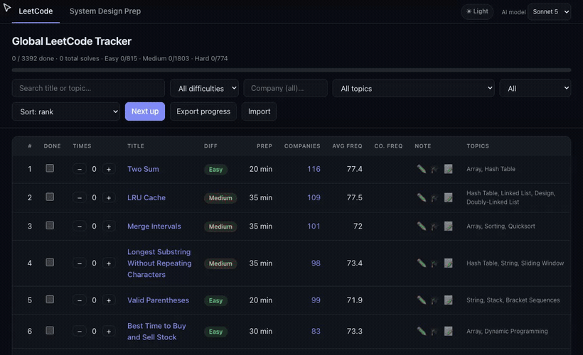
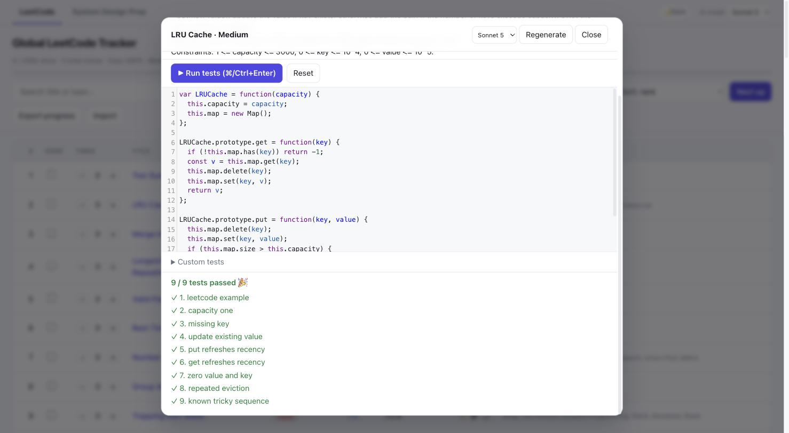

# Engineer for a Day

**Your whole interview loop in one local app, so the real one feels like a rerun.**

Interviews ask for more than reversing a linked list now. You'll be asked to design a system on a whiteboard, tell a story about the time you disagreed with your manager, pair with an AI that's confidently wrong, review someone's PR, and stay calm while production is on fire. This app lets you practice all of it before it counts.

It runs on your machine and keeps everything there. The AI parts use your existing `claude` login.

```
python3 server.py
# open http://localhost:8000
```

That's all the setup. Pick a tab and start.

---

## What's in the box

| Tab | What you're practicing |
| --- | --- |
| 🏢 **Engineer for a Day** | A full simulated workday: tickets, a PR, Slack, an incident, a handoff |
| 🤝 **AI Pairing** | Building with an AI assistant that's sometimes quietly wrong |
| 🏗️ **System Design Prep** | Fundamentals, timed mock interviews, and a whiteboard |
| 🎤 **Behavioral** | STAR stories, plus an AI interviewer that asks follow-ups until it gets specifics |
| 🧩 **LeetCode** | Company-tagged problems with walkthroughs and an in-browser editor |
| ⏱️ **Assessment** | Timed online-assessment (OA) style tests with hidden test cases |
| 💼 **Jobs** | Live openings from the companies you're prepping for |

---

## 🏢 Engineer for a Day

This one gave the app its name. It's the closest thing to a work trial without the work trial.

It's your first day on a fictional team. You get a small repo, Slack-style channels and DMs full of coworkers, a ticket to ship, a PR to review, docs, production logs, and an incident page that arrives around lunch. The clock runs from 9:00 AM to 5:30 PM in about 75 minutes, and it pauses when you switch away from the tab.

Your coworkers are AI, and each has their own agenda. Some of them will tell you things that sound right and aren't. When you click **End day**, every test suite runs and a manager-style review scores how you debugged, the quality of your code and tests, how you reviewed the PR, how you communicated, and the calls you made about what mattered.

Three days to choose from:

- **ShipFast: orders & payments.** Ship discount codes, review a charge-retry PR, and work out why customers are being charged twice.
- **Huddle: push notifications.** Build quiet hours, review an in-memory rate limiter, and track down duplicate pushes.
- **Plotline: subscriptions & billing.** Handle mid-cycle upgrades, review a renewal batch job, and find out why people are charged after they cancel. (Hint: time zones are involved.)

## 🤝 AI Pairing

More and more interviews hand you an AI assistant and watch how you use it. Here you build small JavaScript projects with an assistant that is helpful most of the time, but some of its replies contain flaws planted on purpose. At the end you're graded on the code and on how well you worked with it: whether you caught its mistakes, checked its claims, and ran the tests.

15 scenarios from Easy to Hard: an LRU cache with TTL, a token-bucket rate limiter, offline sync, an Express-style middleware router, a **PR review** round, an **elevator object-design** round where the requirements change partway through, and more.

## 🏗️ System Design Prep

A guided path from the fundamentals to full designs, with topics, practice problems and mock interviews.



**Mock interviews.** Pick a problem and a time limit, then work through it with a pacing timer for each step of the framework. Ask the AI interviewer clarifying questions, and keep your back-of-envelope math in a scratchpad.



**Whiteboard.** Sketch the design with boxes, databases and arrows that stay attached when you move things. Export it as SVG or PNG, or ask the AI to critique it.



**Score yourself** on each step of the framework, then save the attempt to your history with your reflection and scratchpad.



## 🎤 Behavioral

"Tell me about a time you disagreed with your manager." Better to have that story ready in advance.

- **A question bank** tagged by competency (conflict, ambiguity, failure, influence, mentoring and more), by the companies known to ask each question, and by the Amazon Leadership Principle it probes. Competency chips show where you've practiced and where you have gaps.
- **Practice one** picks a question that's due for review (or one you haven't tried), then times a 2 to 3 minute answer. Questions come back on a 3, 7 and 21 day spaced-repetition schedule, and each one has a notes field for the story you'd tell.
- **Interview me with AI** runs a mock round for your target level, Senior or Staff. The interviewer asks follow-ups aimed at the weakest part of your answer: what *you* did rather than "we", how you measured the result, what you'd do differently. It won't let you dodge. **Finish and grade** scores your answer, quotes the lines that cost you points, and tells you whether the story reads at the level you're targeting.

## 🧩 LeetCode

Algorithms still come up, so this tab covers them too. It has tons of problem-company pairs across about 430 companies, with how often each company asked each problem in the last 30 days, 3 months, 6 months and earlier.

**Browse, filter and track.** Search by title or topic, filter by difficulty and company, sort by how often it's asked, and tick problems off as you solve them. Problems that come up a lot in senior loops get a **Senior** badge with a note on why they're asked.



| Dark | Light |
| --- | --- |
|  |  |

**Learn.** An AI walkthrough takes each problem from brute force to the optimal solution, in Python, JavaScript or TypeScript.



**Practice.** Write your solution in the browser and run it against the tests.





## ⏱️ Assessment

Timed tests in the style of an online assessment. Choose Quick (1 Medium in 30 minutes), Standard (Easy, Medium, Medium in 60) or Tough (Medium, Medium, Hard in 90). As on the real platforms, you see a couple of sample cases and the rest of the tests are hidden.

## 💼 Jobs

When you're ready to apply, this tab lists live US software openings from the companies in the tracker. Filter by keyword, company, state, seniority, remote, and how recently the job was posted. Click **Refresh** the first time you open it to pull fresh listings.

---

## A game plan, if you want one

1. **Week 1:** Do one Engineer for a Day to see where you stand. The review shows what to work on.
2. **Every day:** Two LeetCode problems from your target company's 30-day list, plus one behavioral question.
3. **Twice a week:** A timed system design mock on the whiteboard, and one AI Pairing scenario.
4. **Before the onsite:** A Tough assessment, an AI behavioral round at your target level, and another workday.

Progress is saved in your browser. Use **Export progress** to back it up.

Good luck. 🚀

---

## Under the hood

<details>
<summary><b>Setup and AI backends</b></summary>

By default the server runs your logged-in `claude` CLI in headless mode, so you don't need an API key and usage counts against your Claude plan. To use the Anthropic API instead:

```
pip install anthropic
export ANTHROPIC_API_KEY=...        # or put it in a git-ignored .env file
WALKTHROUGH_BACKEND=api python3 server.py
```

Other environment variables: `PORT` (8000), `WALKTHROUGH_MODEL`, `WALKTHROUGH_PER_MINUTE` (10), `WALKTHROUGH_DAILY_CAP` (200), `CLAUDE_BIN` (claude). The server listens only on loopback.

</details>

<details>
<summary><b>Project layout</b></summary>

| Path | What |
| --- | --- |
| `server.py` | entry point for the local server |
| `app/` | server code: config, LLM backends, features, routes |
| `web/` | the page (`index.html`) and its scripts |
| `data/` | `companies.csv`, the generated `GLOBAL.csv`, `jobs_boards.json` |
| `aipair_scenarios/` | AI Pairing scenarios |
| `day_scenarios/` | Engineer for a Day scenarios |
| `scripts/` | rebuild and check scripts |
| `docs/` | screenshots and TODO notes |
| `var/` | git-ignored caches and logs: AI walkthroughs and practice exercises, job listings, AI Pairing and Engineer for a Day sessions |

</details>

<details>
<summary><b>LeetCode data and rebuilding</b></summary>

All company data lives in `data/companies.csv` (updated as of 1 June 2025), one row per (company, problem).

Columns: `Company, Difficulty, Title, Link, Topics, Freq30d, Freq3m, Freq6m, FreqOlder, FreqAll`

The `Freq*` columns are how often the company asked the problem in each window: the past 30 days, 3 months, 6 months, more than 6 months ago, and all time. A blank means it wasn't asked in that window. Use the window that matches how long you have before your interview.

`data/GLOBAL.csv` (problems ranked across all companies) and the data embedded in `web/index.html` are generated from `data/companies.csv`:

```
python3 scripts/build_global.py                  # rank by all-time frequency
python3 scripts/build_global.py --window 30d     # or 3m, 6m, older
```

The same script embeds `data/senior_favs.json`, a hand-curated list of problems that come up a lot in senior loops, with why each is asked and a typical follow-up. These get the **Senior** badge (hover it for the note), and the **Senior favs** checkbox shows only them. To change the list, edit the JSON and rerun the script. It stops with an error if a slug isn't in the data.

</details>

<details>
<summary><b>Jobs data sources</b></summary>

Selecting the tab and filtering only read the local server's cache. The **Refresh** button is the only thing that contacts the public Greenhouse, Lever, Ashby and Workday job boards (through `server.py`, at most once every 5 minutes). Only companies on those systems are covered (about a third of the tracker). Google, Amazon, Meta, Microsoft and Apple run their own career sites, so the tab links to them instead.

`python3 scripts/build_jobs_boards.py` rebuilds `data/jobs_boards.json`, the company-to-board mapping. Workday is one generic connector configured per company as `{"ats": "workday", "host", "tenant", "site"}`. Add one with `python3 scripts/build_jobs_boards.py --workday "CrowdStrike" crowdstrike.wd5.myworkdayjobs.com/crowdstrikecareers`, or let the script probe for the tenant.

</details>

<details>
<summary><b>Writing an AI Pairing scenario</b></summary>

Each scenario is a folder in `aipair_scenarios/<id>/`:

| File | Sent to the browser? | Purpose |
| --- | --- | --- |
| `scenario.json` | yes | title, brief, requirements, list of editable files |
| `files/` | yes | starter code |
| `tests.js` | yes | hidden tests, run in a Web Worker (`test`, `assert`, `eq`, `throws`, `require`, `mkClock`, `mkDeferred`, `flush` are provided; tests may be `async`, and a promise that never settles fails after 2s) |
| `visible_tests.js` | yes | optional. Turns on visible-tests mode: the file appears as a read-only tab, **Run tests** runs only it, the assistant can read it, and `tests.js` becomes extra hidden edge cases that run together with it on Finish (their names are prefixed `[hidden]`). The starter should pass some visible tests and fail others, e.g. `checkout/` |
| `pr.md` | yes | review scenarios only (`"kind": "review"` in `scenario.json`): the pull request page (description, a ```` ```diff ```` block, a review-bot comment), shown as a read-only "pull request" tab. The starter files are the PR branch, `visible_tests.js` is the PR's own (passing) tests, and the candidate writes findings in an extra `review.md` tab, e.g. `review-room-booking/` |
| `followup_visible_tests.js`, `followup_tests.js` | yes | object design scenarios only (`"kind": "lld"`, with a `followup` {title, brief, requirements} in `scenario.json`). The candidate writes an editable `design.md` first (code files stay read-only until then), and the follow-up requirement appears when the visible tests first all pass or at 60% of the time. From then on these tests run with the others, and the evaluator sees a diff of every change made after the reveal, e.g. `elevator/` |
| `secret.json` | never | the planted flaws: `id`, `title`, `trigger`, `wrongClaim`, `correctBehavior`. Review scenarios also list `issues` (the bugs seeded in the PR: `id`, `title`, `severity`, `where`, `detail`), which the evaluator grades `review.md` and the fixes against. In object design scenarios a flaw can be `"design": true` (design advice, no mutant; the evaluator judges it) or `"followup": true` (offered only after the follow-up is revealed) |
| `solution/` | never | reference solution |
| `mutants.json`, `mutants/` | never | one deliberately flawed variant of the solution per planted flaw (and per seeded issue in review scenarios) |

Which replies were flawed is logged server-side in `var/aipair_sessions/` (git-ignored), never sent to the browser. The evaluator reads that log when you press Finish.

After adding or changing a scenario, check it:

```
node scripts/verify_aipair.js              # all scenarios, or pass ids
```

It runs the real test harness (visible and hidden tests together) and requires that the starter does not pass everything (and, in visible-tests mode, passes some visible tests and fails others), the solution passes every test, and every planted flaw has a mutant that at least one test catches. Review scenarios instead require the PR's own visible tests to all pass on the starter (CI is green), and every seeded issue needs a caught mutant too. Object design scenarios need the follow-up files, run the follow-up tests with the rest, and skip the mutant check for design flaws.

</details>

<details>
<summary><b>Writing an Engineer for a Day scenario</b></summary>

The tab lives in `web/day.js` and `/api/day/*` (`app/routes/day.py` + `app/features/day.py`). The test harness, runner and Apply helpers are shared with AI Pairing through `web/workspace.js`. Coworkers' planted flaws work like the ones in AI Pairing.

Each day is a folder in `day_scenarios/<id>/`:

| File | Sent to the browser? | Purpose |
| --- | --- | --- |
| `day.json` | yes | `service` (repo name shown in the UI), `testFile` (name of the existing suite), `incident` (`name`, and the timeline id of the `page`), personas (public card), channels (members, default responder; `locked` until unlocked), tickets, PRs, docs, logs, repo file list, tasks, and the `timeline`: events with `at` (sim time) and/or `when` (a trigger: `incident_resolved`, `pr_reviewed:<id>`, `ticket_replied:<id>`, `posted:<channel>`), optional `unless` and `after`, doing a `message`, `page` or `nudge` (repeats while a channel stays quiet), and optionally unlocking items |
| `files/` | yes | the repo at the start of the day |
| `tests/visible.js` | yes | the existing suite (read-only tab, must pass on the starter) |
| `tests/feature.js`, `tests/incident.js` | yes | hidden suites, run when the day ends (must fail on the starter) |
| `prs/`, `docs/`, `logs/` | yes | the PR page, docs and production log (`logs.example` in day.json is the filter hint) |
| `secret.json` | never | per-persona voice, agenda and knowledge (`seesCode: true` gives that coworker the candidate's working copy); planted flaws (each names a `persona`; `"judged": true` means no mutant, the reviewer judges it); the PR's seeded `issues`; the incident root cause; key points per task |
| `solution/`, `mutants.json` | never | reference fix and one mutant per testable flaw |

Served flaws are logged in `var/day_sessions/` (git-ignored). Check a day after changing it:

```
node scripts/verify_day.js                 # all days, or pass ids
```

For testing, `?dayspeed=20` in the URL runs the clock 20x faster.

</details>

## Dependencies

The server uses only the Python standard library, and there's no `npm install`. These are the things the app does rely on:

| Dependency | Required? | Used for |
| --- | --- | --- |
| [Python 3](https://www.python.org/) | yes | runs `server.py` and the `scripts/build_*.py` data scripts |
| [Claude Code CLI](https://docs.anthropic.com/en/docs/claude-code) (`claude`) | yes, for AI features (default backend) | walkthroughs, AI interviewers, coworkers, the pairing assistant and grading |
| [`anthropic`](https://pypi.org/project/anthropic/) Python SDK | optional | only with `WALKTHROUGH_BACKEND=api` |
| [CodeMirror 5.65.16](https://codemirror.net/5/) | yes, loaded in the browser | code editor in LeetCode Practice, Assessment, AI Pairing and Engineer for a Day. Loaded on demand from `cdnjs.cloudflare.com`, so these editors need an internet connection |
| [Node.js](https://nodejs.org/) | optional | only for `scripts/verify_aipair.js` and `scripts/verify_day.js` when writing scenarios |
| Greenhouse, Lever, Ashby and Workday public job boards | optional | fetched only when you click **Refresh** in the Jobs tab |

## Credits

- System Design Notes: https://github.com/liquidslr/system-design-notes
